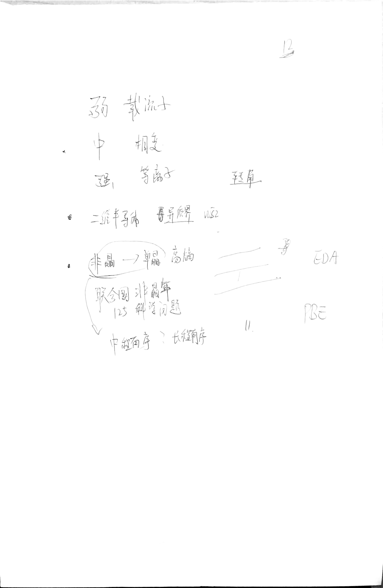

# 日记

## 2022-4-13

### 健身笔记

#### [利用梦境来学习和遗忘【Huberman Lab Ep.5】](https://www.bilibili.com/video/BV16A411K76e?spm_id_from=333.999.0.0)

- 慢波睡眠 ：motor learning （运动学习），detail learning 发生在早期慢波睡眠
- 快速眼动期：完全瘫痪，幻觉与梦。通常在早上。梦境通常表现为具有挑战性的事情，比如迟到在公共场合裸体，以及对比白天事件的重放。缺乏可使人情绪暴躁。巩固事物之间的联系。具有消除无关意义的惊人能力。有助于消除痛苦。 
- 失眠时可以尝试NSDR
- 眼球横向移动 并复述经历 抑制 杏仁核 ：EMDR，用于治疗情绪创伤。
- 如何获得适量的两种睡眠，并知道自己已经获得了 适量的睡眠
	- 规律睡眠对学习的影响更大 每1h变化降低17%考试表现
	- 减少REM的方法：睡前多喝水、抗阻训练
	- 减少清醒梦：睡眠时间是90分钟的倍数

## 2022-4-12

昨天没写日记哦，主要就是看了看ofdft+Maxwell理论和应用。

### 科研

米老师邀请米老师交流了科研应用，收获颇多。# TODO 整理一下

## 2022-4-10

### 健身笔记

#### [利用科学优化睡眠&学习&新陈代谢 【Huberman Lab Ep.3】](https://www.bilibili.com/video/BV1YK4y1Q7PC)

- 运动
	- 时间 醒后 30min 3h 11h 
	- 上午心血管运动 阻抗运动
	- 睡眠量不变醒来时没有感到休息和恢复：前两三天运动量过高
	- 无论睡多久仍感到困倦：训练量太高了

- 学习
	- 睡眠时出现与学习时相同的气味或音调，有助于增强学习能力
	- NSDR 后的20min学习效果相当于90min正常学习
- 节律
	- 体温 下午5点左右最高，冷水澡有助于清醒和睡眠。寒颤有助于减脂，减少寒颤有助于增强耐力。
	- 早餐低碳水晚餐高碳水
	- 记录清醒时间，观察日光时间，健身时间以及感受

## 2022-4-9

### 文献阅读

nope

 ### 健身笔记

[日常生活中的神经科学 Huberman Lab Podcast](https://www.bilibili.com/medialist/play/107538976?from=space&business=space_collection&business_id=21644&desc=0&spm_id_from=333.999.0.0) 这个合集不错。以后多看看

#### [掌控睡眠 【Huberman Lab Ep.2】](https://www.bilibili.com/video/BV1Hf4y1r7NT)

adenosin （build when we weak up）

circadian

1. 清醒后尽量看到日光
2. 日落前看日落 
3. 晚间11点到凌晨4点 不要见光，光源放在视野下方。清醒时间越长，越敏感。
4. About snip-- nidra yoga

##### 总结

- 假装课代表
	我大概分成了三机制一分支。
	谈到的三睡眠机制分别是"腺苷-腺苷受体"，"皮质醇-褪黑素影响下的`晨昏定省`"(光相关），"非光调节生物钟"。
- 腺苷:是会产生某种睡眠驱动力/睡眠饥饿感，良好睡眠后其水平很低，10－15h后会增高很多。
	   咖啡因能使人警醒，是因为像停车一样，占据了腺苷受体，腺苷受体无法参与正常的细胞作用。最久12h退散，腺苷与其受体有更强的亲和。"咖啡因中毒"，怎么喝咖啡都睡得着可能是腺苷受体突变。(我在另一地方看到，咖啡因会减少两小时深度睡眠时间
- 昼夜节律"皮质醇-褪黑素"
	光是最主要的授时因子(有机体生物节律同步到地球24小时12月制），在早上接受光线是建立健康睡眠-清醒节律的关键，晚上更易入睡。
	- 皮质醇，低太阳角阳光，特定黄蓝光比激活，大约日出后1－2h。日升中高会错过正确校准皮质醇释放时间，皮质醇增加:很多焦虑抑郁原因之一
		(大概是，特定光-视网膜神经-视交叉上核-各个细胞器官）
		皮质醇上升，人体计时器(细胞计时器，体内不同器官之间关系决定）大概12－14h后，从特定区域(松果体）分泌✘褪黑素的激活，(光会抑制）。
	- 人体中荷尔蒙和神经递质系统，让人在每天特定时间苏醒，入睡。其取决于看到最明亮光线时间的平均值。✘黑视蛋白神经(他同事研究的）:特定波长的光激活，设定人体生物钟，决定晚上何时入睡睡得号。✘日落前后一小时看2－10太阳关照，能抵御夜间光照负面作用，防止褪黑素延迟释放。
	- 夜间清醒时间越长，越敏感。手机灯光也会影响生物钟。23－04点光会抑制多巴胺分泌(光过眼睛向缰核发射信号。其又名"失望核"，激活会失望失落情绪。
	- 睡醒前45min-1h开灯，犯困提前，延长睡眠(光可以透过眼皮)。
- 膝状体间小叶"非光调节生物钟"。通过运动饮食调节。所以早起还要运动嗷

分支

- 交感神经¹＋副交感神经²＝自主神经系统
	¹兴奋刺激相关，²休息舒缓相关
	- 非睡眠深度休息(NSDR）有重置清醒能力，更清晰，更能稳定情绪，更易夜间入睡
		例如::瑜伽¹，冥想²，午睡³，可以进入交感神经系统不那么活跃的状态，激活促进副交感神经系统(休息)。其中¹²能让多巴胺和其他神经调解质进入大脑纹状体区域(参与运动计划运动执行），让其重置

## 2022-4-8

### 杂记

有时候在想，这一天天的在干啥呢。也不知道自己在干嘛。科研现在太无聊了，是不是要转一个方向呢。去当一个码农，解决点工程问题，也挺好。

看手机真的是太无聊了。有的时候静静地躺着，就想起高中时的生活。躺在床上也是这种感受。即无聊又惬意。

我真的很想要有个大房子，可以把家打理成我想要的样子。（虽然可能不会去打理）很羡慕美国的房子。在中国房子是有点贵了。也不知道将来自己能挣多少钱。可能，就走一步看一步吧。这个真的是个人的命运。就比如说如果我小一届的话，像师弟一样，是不是又有科研又有钱了。不过又不可能啥都要比较，我现在只是有些无聊，对科研提不起兴趣。其他生活上都还好。

所以我想，要不要把微博，知乎，哔哩哔哩都卸载了。反正也没啥用，知道多了也没啥用，还让自己累的要死。至少坚持到解封吧！希望下周可以出去溜达溜达。

这几天健身的还好，感觉更有力气了。虽然没有减重多少，但这只是因为没有限制饮食。赶紧变成肌肉男，好可以对着自己撸。痘痘的话，少熬夜，少喝牛奶。

## 2022-4-7

### 科研

- M-TDOF 优势：做的体系大，Mg Al Ga As
-  领域 ：High harmonic generation（[attosecond physics](https://en.wikipedia.org/wiki/Attosecond_physics)）electronic stopping power [12,23], spectra of clusters [19], and plasmonics [24–26], have been also studied with the “time-dependent”OF (TDOF) approach. In this case a single time-dependent Schrödinger equation has to be solved with the additional difficulty that the KE potential is time dependent [27]

### 组会

- 王老师提出新的方向--H He 互融 K Na 互融 可以试着用 revHC

- 好像我要忙一些数据库的活了

### 杂记

​	学着画一些速写也挺有意思的。没事看看帅哥美女都画下来。

## 2022-4-5

### 杂记

一干正事就犯困，今天我尽力的去看文献了，但是感觉还是看不下去。因为感觉没啥意思。很羡慕那些可以一直学习的，不过我已经做的很好了。

今天研究了M-TDOF(M-TD-OF-DFT)有啥用处，好像也没研究出来啥，今天太晚了，我要睡觉了。明天在这里写一写。
